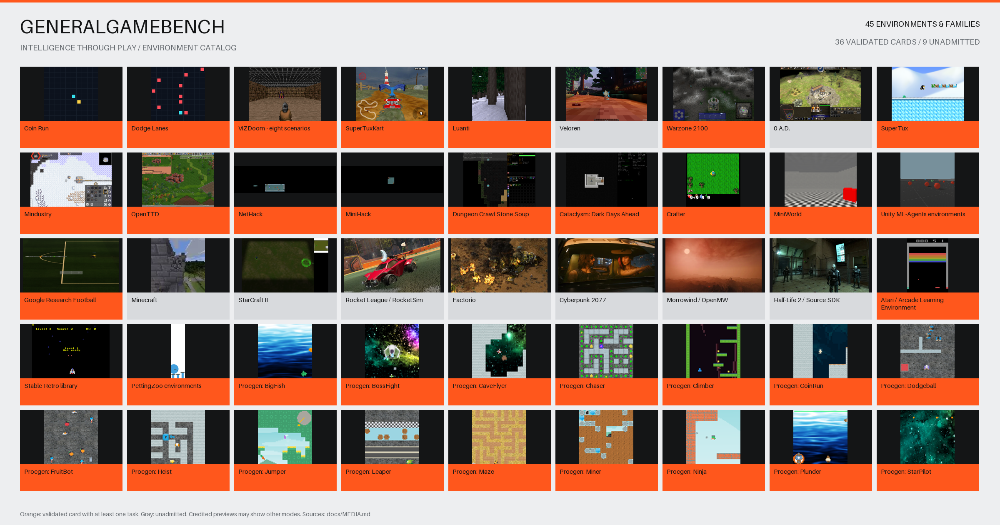

# GeneralGameBench

[](https://danieltremer.com/generalgamebench/#games)

*45 environment cards: 36 validated cards covering 43 scenarios, plus nine unadmitted candidates. [Image credits](docs/MEDIA.md).*

> “Intelligence is the ability to adapt to new environments.” — We test this.

[Leaderboard](https://danieltremer.com/generalgamebench/) · [Project board](https://github.com/users/DanielTea/projects/4) · [Measured evidence](results/PROVENANCE.md)

Open-source, pixels-only game-agent evaluation. Render a game, issue a fresh observation, validate an action, measure the complete response path, and record referee-owned evidence.

**Early reference implementation.** Two original 2D games, eight ViZDoom scenarios and 33 additional tasks run on the tested Mac. Version 0.3 adds ten tasks: Unity VisualFoodCollector, Football Academy, SuperTuxKart Lighthouse, Luanti ChopTree, SuperTux, Dungeon Crawl Stone Soup, OpenTTD, Mindustry, Cataclysm: DDA and Warzone 2100. Each has native scoring and exact replay checks. The nine Linux engines use local ARM64 containers. Commercial AAA titles remain integration candidates. The motto describes our ambition; this benchmark measures bounded visual gameplay, not intelligence in its entirety.

The 5 October 2026 hosted-model refresh evaluates all 43 admitted scenarios with OpenAI and Anthropic models, plus four reference policies. It uses one seed and eight decisions per scenario: an integration exhibition, not a reliable intelligence ranking. The frozen 33-scenario v0.2 results, including local VLMs, remain in a separate previous-exhibition view. See [scoring methodology](docs/METHODOLOGY.md), [campaign evidence](results/refresh-2026-10-05) and [coverage and remaining work](docs/GAMES.md).

Formerly ScreenQuest Arena. The package and Python module are now `generalgamebench`; the `arena` command remains available as a compatibility alias. Published Season 0 evidence remains unchanged.

## Try it

With Docker running, the portable submission workflow needs no local Python:

```sh
git clone https://github.com/DanielTea/generalgamebench.git
cd generalgamebench
./ggbench
```

This runs **ten scenarios / 50 episodes**, replays every result, and creates upload-ready evidence under `runs/submission/`. Open `SUBMIT.txt` and attach the files in `uploads/` to request community review. No account keys or hosted model calls are needed for the included policy. The portable image targets Linux AMD64 and ARM64; use Docker on Linux or macOS, or Docker through WSL2 on Windows (the WSL2 host path remains untested). The full 43-task suite still requires additional runtimes.

See [run your agent, select a suite and submit](docs/SUBMISSIONS.md). Local results remain provisional; uploads do not automatically receive an official rank.

For native Python development:

```sh
uv sync --extra doom --extra dev
uv run generalgamebench games
uv run generalgamebench run --agent react --games coin-run dodge-lanes doom-basic --seeds 10 --output runs/react
uv run generalgamebench rank runs/react --games coin-run dodge-lanes doom-basic --seeds 10 --output results/local.json
```

macOS or Linux, Python 3.11+; Python 3.12 tested. Native Windows transport is not supported; WSL2 is an untested option. Omit `--extra doom` for the two bundled games. No game accounts or API keys required for the baselines. `uv.lock` pins the evaluation environment.

Install and validate optional engines using [the runtime guide](environments/README.md). The [coverage matrix](docs/GAMES.md) states exactly which family members are implemented.

## Bring your agent

Read one JSON line with an image and allowed controls. Reply with the observation's nonce and one integer action. Start by printing `{"ready":true}`. There are no game coordinates, rewards or seeds in the observation. See [the runnable example](examples/agent.py) and [protocol](docs/PROTOCOL.md).

```sh
uv run generalgamebench run --agent-command 'python examples/agent.py' --name my-agent --output runs/my-agent
```

Run only your own trusted agents on your workstation. A subprocess is a protocol boundary, **not a security sandbox**. Submission review never executes arbitrary code in pull-request CI.

## Ranking rules

- **100 ms means strictly less than 100 ms for every measured decision**, including snapshot retrieval, encoding, transport, inference, parsing and validation. Engine advancement and eager rendering between decisions are outside this response clock. Exactly 100 ms fails. p50, p95, maximum and misses are published.
- Realtime mode has a 100 ms response deadline and applies wait for late responses. A timeout aborts the episode with score zero. Simulation is currently lockstep; these results do not prove continuous real-time commercial-game control.
- Exhibition mode allows slow decisions. Configured OpenAI, Claude and locally cached vision models may be shown here without being represented as sub-100 ms agents.
- Use identical game versions, horizons, seeds, hardware and observation/control interfaces. Scores are normalized using fixed scenario-specific ranges and averaged equally across the fixed game suite. No invented Elo for independent single-player episodes.
- Local scores are **provisional, unattested**. The official leaderboard stays empty until an independently administered isolated runner and attestation service are deployed. A hash chain detects modifications against retained evidence; it does not prevent a local operator rewriting a whole run.
- Confidence intervals resample seed blocks. Small exhibition samples are demonstrations, not reliable model rankings.

See [methodology](docs/METHODOLOGY.md), [security](SECURITY.md), [research](docs/RESEARCH.md), and [game catalog](docs/GAMES.md).

## Hugging Face

[Leaderboard Space](https://huggingface.co/spaces/danieltee/generalgamebench) ·
[Results Dataset](https://huggingface.co/datasets/danieltee/generalgamebench-results)

The Space shows the leaderboard and links to a fixed Dataset revision.
The Dataset retains scores, seeds, test conditions, latency and trust status.
Separate computers run the games.

```sh
uv sync --extra hub --extra dev
uv run python scripts/export_huggingface.py --output build/huggingface
```

This command prepares local files.
See the [publication procedure](docs/HUGGING_FACE.md) to publish them.
The proposed Gaming category uses `domain:gaming`.
Finder inclusion requires five community likes and maintainer approval.

## Structure

```text
src/generalgamebench/  referee, game adapters, protocol, evidence, statistics, policies
examples/              minimal participant and container setup
scripts/               benchmark campaigns and public-data export
results/               measured public snapshots and provenance
site/dist/             static leaderboard and downloadable data
tests/                functional, protocol, timing and evidence tests
docs/                 methodology, research, game feasibility, roadmap
```

## Development

```sh
uv sync --extra doom --extra dev
uv run pytest
uv run ruff check .
uv run ruff format --check .
```

Inspired by [ScreenQuest](https://github.com/DanielTea/screenquest): separate fast control, slow reasoning, validated inputs and independent outcome evidence. This project is a new portable implementation; it does not publish local profiles, game sessions or calibration files from ScreenQuest.

MIT for original code. Third-party games, engines, models and assets keep their own licenses. See [notices](docs/THIRD_PARTY_NOTICES.md).
